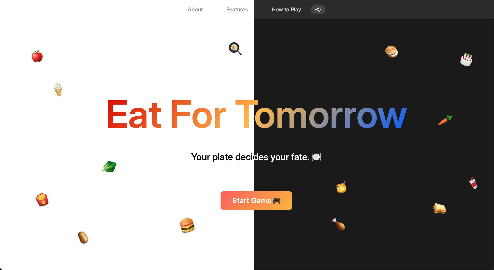

# 🍎 Eat For Tomorrow: The Food Choices Journey 🍈

  

  <em>Eat For Tomorrow: Dual Theme Preview</em>

**Eat For Tomorrow** is a fun, story-based game where every bite matters 🍔🥗  
Over **14 days**, you’ll make daily food choices that affect your **Health ❤️, Wallet 💰, and Environment 🌳**

At the end, your stats unlock one of several endings — will you become an **Eco Hero** 🌳, go broke but healthy, or fall into a **Fast Food Fallout**?  

---

## ✨ Features  
- **14 Days of Choices**: Every day presents you with a unique food scenario  
- **Emoji Stats**: Track Health ❤️, Wallet 💰, and Environment 🌳 in a simple, visual way  
- **Mini-Games**: Play fun challenges like ⚡ Quick Click, 🃏 Memory Game, 🥗 Eco-Plate, and 🛒 Supermarket Dash to keep the journey exciting  
- **Multiple Endings**: Your path leads to different outcomes (Eco Hero, Middle Path, Wealthy but Wasteful, etc.)  
- **Replayability**: Different runs = different stories!  

---

## 🎮 How to Play  
1. Begin your journey by clicking the **Start Game** button.  
2. Each day, read through a new food scenario that challenges your decision-making.  
3. Along the way, test your skills with fun mini-games (*see table below for when they appear*):  

| Day | Mini-Game         | Description                                   |
|-----|-------------------|-----------------------------------------------|
| 3   | ⚡ Quick Click     | A fast-paced reflex test — click as quickly as possible. |
| 7   | 🃏 Memory Game     | Flip cards and match pairs. |
| 11   | 🥗 Eco-Plate       | Choose healthy foods onto the plate. |
| 13  | 🛒 Supermarket Dash| Catch healthy foods and coins in your trolley. |

4. Choose from **4 different options** each day to shape your story.  
5. Watch your **health, wallet, and environment stats** update instantly after every choice.  
6. Survive all 14 days and uncover your unique ending based on your decisions!  

---

## 🛠️ Tech Stack
- Built with **HTML, CSS, and JavaScript**
- Lightweight and mobile-friendly

---

## 💌 Credits  
Made with love ❤️ by **Keluar** for the Hackathon.  

### 👥 Team Keluar Members
<table>
  <tr>
    <td align="center">
      <a href="https://github.com/Ling2609">
         
        <b>Ling2609</b>
      </a>
    </td>
    <td align="center">
      <a href="https://github.com/sevenpluseight">
         
        <b>sevenpluseight</b>
      </a>
    </td>
  </tr>
</table>
